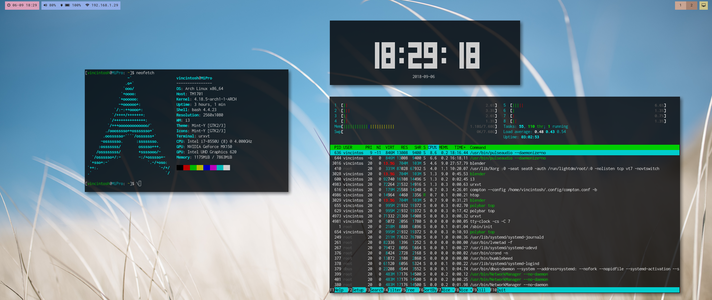

# dots (September 2018)
dotfiles for my Arch + i3-gaps configuration (September 2018)

I bought a new ultrawide external display, so I thought it would be worth renewing my desktop interface setup

**Window Manager**: i3-gaps

**Bar**: Polybar

**Shell**: Bash

**Terminal**: URxvt

**Notification Daemon**: twmn

**Compositor**: Compton

**Menu**: Rofi

**Theme**: Mint-Y

I will use this page to summarize how my desktop setup works. Jump to *TL;DR* if you just want basic information on what is in this repository.

## Display management

Everytime I login, it runs a script that uses *xrandr* to disable the laptop display though: I don't use that much and I think it is a waste of energy having it always on. If I want to change this behaviour, I have a button on the far right of polybar to switch between these two setups. If the external display isn't connected, it automatically falls back to the laptop screen as nothing ever happened.
This same script then runs *feh* to set the wallpaper and then launches *polybar* so that it can properly adapt to the screen layout. I need the script to do this because, before doing anything else, it needs a *sleep* command or it doesn't work properly (I let it sleep for just .1 seconds), probably because it has to wait for *xrandr* to recognize the connected displays. At the end of its job, the screen runs a notification command with a "Welcome back" message so that I also have a startup sound (see *Notifications*).
Disconnecting the external display while the laptop display is disabled results in a blank laptop screen: I didn't address this issue because I have an *nVidia Optimus* card and *udev* won't recognize display (dis)connecting events. Any (possibly rather easy) suggestions are well accepted. For now I solved it the lazy way: I've bound a script to the *Mod+Shift+Print* key combination inside of i3 config file that simply restores the screen layout to only use the laptop screen, it works very good and it's pretty fast.

## i3-gaps
### Autostart
*i3-gaps* can run useful stuff when it is started up by the display manager (or *startx*). It runs the above mentioned script, then it starts *twmnd* (tmwn daemonized, for notifications handling - see *Notifications*), *compton* (compositor) and *redshift* (shift screen colors to a warm tint based on sunset/dawn time in your location). Configuration files for *compton* and *redshift* aren't included as the first is exactly the same as the default one (maybe only with slight modifications on the timing of dissolve transitions) and the latter includes sensible information (i.e. latitude/longitude - other modifications i've made are warm and cold temperatures, respectively 4500K and 6000K).

### Workspace management
*i3-gaps* is set to use the external display for workspaces 1-8 and the laptop display for workspaces 9-10: if no external display is connected it falls back to all workspaces on the laptop display by default. Workspaces are switched with the default keys on the keyboard (WS 10 is assigned to the 0 key). No particular label was chosen for workspaces as having just their bare number on polybar looks very clean and is also easy do identify when you want to switch workspace.

### Window Resizing and Gaps
These functions are assigned to specific "modes" which you can trigger with keyboard shortcuts.
Once entered *"resize"* mode, you can resize windows with arrows or vim bindings.
*i3-gaps* is a fork of *i3-wm* that allows **gaps** between tiled windows. You can modify on the fly the value of said gaps. Once entered *"gaps"* mode, you can choose whether to modify outer or inner gaps and then it enters specific "sub-modes" (I guess you can call them so) where you can increase/decrease/reset the gaps. There's also a key binding to reset the gaps to the initial settings.
resembles pretty
### Other functions
Volume and media controlling functions are included for both the laptop (that has media keys) and external (that uses F1-12 keys) keyboards.
There are also key combinations for killing/restarting polybar manually, upgrade the system (using *pacman*), changing the wallpaper (runs *feh* on my wallpapers directory and makes it choose an image file randomly) emptying the trash (uses a script, that also plays a sound when done) and asking for battery remaining time (using another script that sends a notification with "power cord connected" if you are charging the battery or with the estimated remaining time if you are discharging the battery).

## Polybar

Polybar is set to have a completely transparent background. Modules will have their own background color. This creates the illusion of multiple open bars. The date-time module has some additional padding to add some separation from the other modules (which I call "core-info" modules because they display basic system information, such as volume, battery and wifi state). On the other side there's the i3 module that shows used workspaces and a simple *text* module that allows to switch between screen layouts as above mentioned. When tray applications are running (such as *nm-applet* or *caffeine*) the tray appears on the far right with a greenish background.
The overall look of the bar wants to pretty much resemble material design applications, but the RobotoMono font adds that touch of Unix sexiness to it. You'll need *FontAwesome* and the patched *RobotoMono Nerd Font* to make the bar icons show properly.

## Notifications
*twmn* is the notification daemon. I use it instead of the more popular *dunst* because it allows for scrolling-animated notifications. It is configured to show notifications with a greenish background and to play a sound everytime a notification is sent through the *notify-send* command, so that I have a nice notification sound. If you want you can use *twmn*'s own console backend *twmnc* to send notification with specific one-time-use settings: I use this trick to send notifications when *ncmcpp* changes song: it sends light yellow notifications and uses a blank wav file as notification sound (so that no sound is played while you're listening to music). If you use this trick, only specified settings will be overwritten: anything else will be the same as specified in the *twmn* config file.

## Rofi
*Rofi* is my menu system. It is configured to open the *drun* window by default (by pressing *Mod+D*). I prefer this over the standar *run* mode, because it presents you with a list of applications based on their actual name instead of their run command, which looks much cleaner. If I need the *run* menu, I just press ALT+2 key combination while *Rofi* is open. *Mod+Tab* opens it in window switcher mode that presents you with a list of all of the active windows and you can switch between them. I also have two scripts that run rofi with a favorite apps menu and an exit menu (with shutdown, reboot etc...).

## URxvt
*URxvt* is my terminal of choice. It is configured with custom colors and transparency. The latter is true transparency, so *compton* is mandatory to achieve this effect, otherwise fake transparency can be used: this only allows to see the desktop wallpaper through URxvt: if its window is in floating mode and it is positioned above other windows, you won't see their content through URxvt, instead the wallpaper will still be shown. Of course this is not the behaviour I want, so I use true transparency, even if it is a bit more resource heavy.

## Interface theming
I tried *Linux Mint* for roughly a week and I liked its interface so much, so I used its *Mint-Y* theme for icons and GTK. Some wallpapers are also taken from *Linux Mint*. Everything is available on the AUR.

## Other apps
Other software I use on a daily basis

+ **Blender**: I mainly use its *video sequence editor*. It is still the best choice in linux video editing because it is acceptably fast, feature rich and also very stable. It is a bit difficult in the beginning, but it is worth learning (there are many YouTube videos on the argument). It's got pretty much every function you may possibly want, but being a bit tricky to understand, I often forget how to do something, so I revert back to **Kdenlive** when I quickly need to do something I can't go back learning at the moment. Although *Kdenlive* is very user-friendly and feature rich, it is still very annoyingly unstable (it's got amazing auto-save/recovery capabilities though) and also it can't take advantage of your full hardware capabilities (multi-thread and GPU rendering are still experimental and only add instability to the software if you enable them), resulting very slow when scrolling through the timeline and adding effects and other modifications. I also sometime do some 3D modeling on blender for 3D printing, but I'm still learning this subject, so I often revert to the online version of **Tinkercad** for this.

+ **GIMP**: no need to say much about GIMP. It's stable, reliable, it's got many many functions (you just need to learn where they are) and I don't miss *Photoshop*, at least feature-wise.

+ **Darktable**: great resource for handling, organizing and developing RAW pictures taken with cameras. It works much like *Adobe Lightroom*

+ **LaTeX**: I used to do much of my university writing work in LaTeX. It's very fast once you get used to it and it can deliver **very very very very very** professional resoults. I wrote my thesis in LaTeX with **vim** and a plugin called **vim-live-latex-preview**, available on Git and on the AUR. I have to thank the youtuber *Luke Smith* for introducing me to this world.

+ **Atom**: I'm getting used to this editor, mainly for its auto-completion features, beautiful interface, folder view and general ease of use. You can achieve most of its functions even with *vim* (which remains my editor of choice) - even though auto-completion is tricky to configure and use - but I like it and I'm using it alongside *vim*. There's so much stuff at which *vim* is simply so much faster.

+ **LibreOffice**: my office suite of choice. We pretty much all know it, nothing special to say about it. It got very far, it's capable of handling pretty much any *MS Office* document and feature and nowadays most people use *Google Docs* and *.odt* files, so it's perfect. If something goes wrong with a shared document, I can still open it in *MS Office* online, as I still have my university subscription to *Office365*. I also have a bunch of fonts installed, even Microsoft fonts so that I can increase the probability of rendering *MS Office* files good.

+ **Firefox**: my browser of choice. Not going too extreme here with terminal based browsers or other less known alternatives. I need to surf the web serenely and I often use *Facebook Messenger* for video calls, which are supported only by *Firefox* and *Chrome*. It's open-source and pretty safe, although a couple of controversies have happened with *Mozilla* recently, but I honestly didn't bother too much about that. I use an extension called *Zoom Page WE* to set a preferred zoom value for single websites that I visit: it remembers these values and restores them when needed. I also have *Translator* which translates webpages, much like *Google Chrome* can do. I also use Firefox sync to keep my history synchronized between my devices.

+ **Thunderbird**: my eMail client of choice. It's fast and reliable and doesn't depend on any Desktop Environment. I've customized it with a *Roboto* font.

+ **Nautilus**: still my favourite file manager. Looks clean, it's fast and handles both *fuse* file systems and *WebDAV* servers very good. I use *WebDAV* to transfer files from my phone wirelessly when I don't have a USB-C cable lying around, and *fuse* to mount remote file systems over ssh and for *ExFAT* formatted devices. I also often use **ranger** though, especially when I'm using the terminal and don't want to switch workspace or move my hand over the mouse. It works very good and it is super fast.

+ **Feh** and **mpv**: my image and video viewers of choice. Keyboard controlled and very fast. Still sometimes using *vlc* and *GNOME Image Viewer* when I'm mostly using the mouse. Same thing goes for **muPDF** and **Evince** as document viewers.

## TODO

+ **Display hot switching**: needs deep understanding of udev rules and probably another PC, since for now *nVidia Optimus* cards with proprietary nVidia drivers aren't supported lol Also, I don't want to run a script in background with a *while* loop that periodically checks wether displays are (dis)connected because it is a dirty solution and it feels like a huge load on the CPU honestly

+ **Install and configure Newsboat**: I still visit every single website that has a news feed. Not so bad, but it would be nice to sorta reunite all of the news in one single place accessible from the terminal using *Newsboat*. It can also display YouTube feeds and open videos with *mpv* (or any other player actually, even outside of the terminal)

## TL;DR

This is a place to reunite all of my configuration files needed for my desktop setup. I use *i3-gaps* and *Polybar*, with *Rofi* as my menu sistem. I have a dual monitor setup and I have configured to use only the external display when it is connected or revert back to the laptop screen when the external one isn't available. Workspaces 1-8 are on the external display and 9-10 on the laptop screen by default. *i3-gaps* is a tiling window manager that allows for configurable gaps between tiled windows and is mainly keyboard controlled. I have different modes to modify the gaps on the fly and even resize windows with my keyboard. Different keybindings allow for different applications to be executed and you will find everything I have set up in the i3 config file. *Polybar* is configured with a transparent background and every single module has its own background color: it tries to imitate *Material Design* applications but with a touch of Unix sexiness using the *Roboto Mono* font (and *Font Awesome* for icons).

## See this setup in action

+ [Reddit](https://www.reddit.com/r/unixporn/comments/9dm3fl/i3gaps_polybar_i_bought_an_ultrawide_monitor_it/)

+ Screenshots: [imgur](https://imgur.com/a/6MnnKYB)

+ [YouTube]
